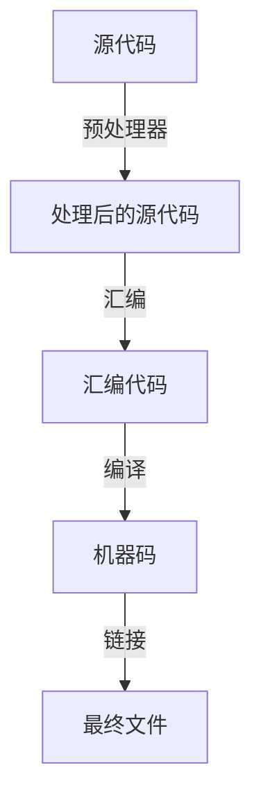

# 从编译器开始

## 1 C/C++ 语言的编译器

### 1.1 Windows

在 Windows 平台下有 3 种常用的 C/C++ 编译器

- MSVC 由微软官方提供，只能在 Windows 平台上运行，编译器 `cl.exe`，链接器 `link.exe`，调试器 `cdb`
- MinGW GCC 由开源社区驱动，将 GNU GCC 套件移植到了 Windows 平台上，推荐使用来自 WinLibs 的编译版本，C 编译器 `gcc`，C++ 编译器 `g++`，链接器 `ld`，调试器 `gdb`，下载链接 [WinLibs](https://winlibs.com/)
- LLVM Clang 由开源社区驱动，在 Windows 平台可以使用 MinGW 或 MSVC 的库文件，取决于你的 Clang 是哪个附带的，可以查看其默认目标三元组（我现在手里没有 Windows 环境，没法截图给你看），C 编译器 `clang`，C++ 编译器 `clang++`，链接器 `lld`，调试器 `lldb`

### 1.2 类 Unix 平台

在类 Unix 平台下有 2 种常用的编译器

- GNU GCC 由自由软件基金会驱动，大部份 Linux 的预装编译器，C 编译器 `gcc`，C++ 编译器 `g++`，链接器 `ld`，调试器 `gdb`
- LLVM Clang 由开源社区驱动，macOS 的默认编译器，C 编译器 `clang`，C++ 编译器 `clang++`，链接器 `lld`，调试器 `lldb`

## 2 C/C++ 语言的编译流程

### 2.1 预处理器

